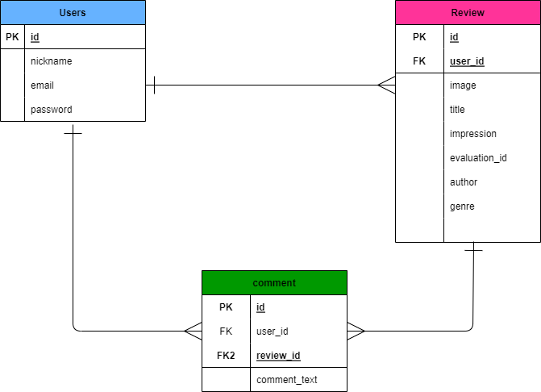
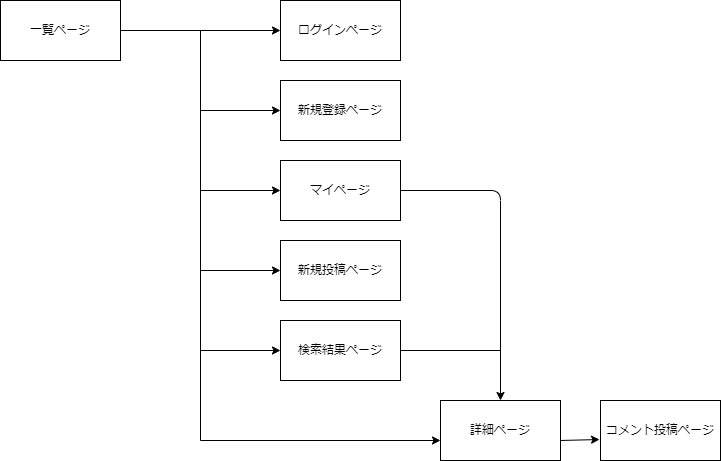

# アプリケーション名

BOOK SHARE

# アプリケーション概要

読み終わった本の感想を投稿し、ユーザー同士で共有することができます。

# URL

https://book-share-ogsx.onrender.com

# テスト用アカウント

テストユーザー1  
email: test1@gmail.com  
password: 123abc

Basic認証  
ID: admin  
password: 2222

# 利用方法

1.トップページ(一覧ページ)のヘッダーからユーザー新規登録を行います。 
2.新規投稿ボタンから、本の詳細(画像・タイトル・作者名・ジャンル・５段階評価・レビューコメント)を入力し投稿します。 
3.一覧ページ・検索結果ページから詳細ページに遷移し、ほかのユーザーの投稿にコメントをできます。

# アプリケーションを作成した背景

学生の頃から小説を読むことが好きで、自分の感想を保存したり、他人の読んだ感想などを聞いたりしたいと考えていました。そのため、SNS上で感想を共有するアプリケーションがあれば、それを実現できると思い、開発することにしました。

# 実装した機能についての画像やGIFおよびその説明

## 必要な情報を入力するとレビューを投稿できる機能

## キーワード検索で検索結果を表示機能

## 投稿に対してコメントできる機能

# 今後実装予定の機能

・他ユーザーの投稿にいいねできる機能
・他ユーザーをフォローできる機能

# 工夫したポイント

投稿内容を検索しやすくするために、キーワードとジャンルを分けて検索できるように工夫しました。
キーワード検索では、「タイトル」「著者」「タグ」の3つの項目に対応させることで、検索を直感的にしやすくしました。
ジャンル検索では、プルダウンで項目を選択させることによって、簡単に検索できるようにしました。

# テーブル設計

## users テーブル

| Column             | Type   | Options     |
|--------------------|--------|-------------|
| nickname           | string | null: false |
| email              | string | null: false, unique: true |
| encrypted_password | string | null: false |

### Association

- has_many : reviews
- has_many : comments

## reviews テーブル

| Column             | Type       | Options     |
|--------------------|------------|-------------|
| user               | references | null: false, foreign_key: true |
| title              | string     | null: false |
| author             | string     | null: false |
| genre_id           | integer    | null: false |
| tag                | string     |             |
| evaluation_id      | integer    | null: false |
| impression         | text       |             |

### Association

- belongs_to : user
- has_many : comment

# comments テーブル

| Column             | Type       | Options     |
|--------------------|------------|-------------|
| user               | references | null: false, foreign_key: true |
| review             | references | null: false, foreign_key: true |
| comment_text       | text       | null: false |

### Association

- belongs_to : user
- belongs_to : review

## ER図

## 画面遷移図

# まとめ

オリアプを作成してみて、0からのDB設計やレイアウト設計などに苦労しましたが、エラーを解消するために、ChatGTPや色々な方の記事を読ませてもらい、自分で調べる能力やとりあえずやってみるといった精神が身についたのではないかと思います。まだまだ実装したい機能や細かい調整をしたい部分があるので、もっと構想を練って完成度を高いアプリを作成して見せます。